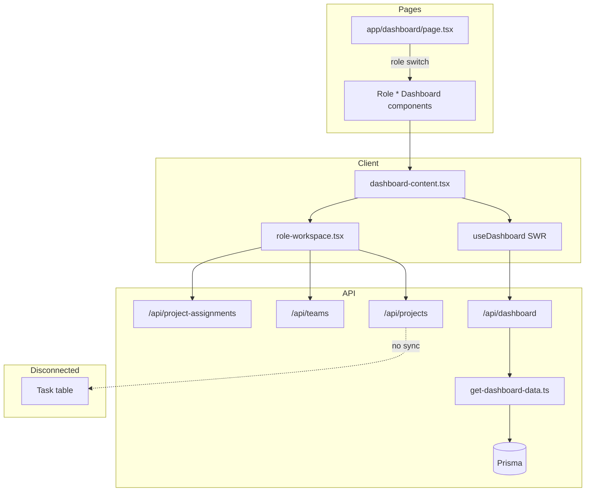

# Team Management System — Update Priorities

**Generated:** May 16, 2026  
**Scope:** Full codebase review with emphasis on **Dashboard** (`app/dashboard`, `components/dashboard`, `lib/dashboard`, `/api/dashboard`).

---

## Executive summary

The **dashboard UI is largely built** (role routing, widgets, charts, timeline, SWR data layer) but many controls are **non-functional**, **sidebar pages are placeholders**, and **project workflow is disconnected from tasks/meetings**. Security around **self-service Admin registration** should be fixed before production.

| Priority | Count | Focus |
|----------|-------|--------|
| P0 — Critical | 6 | Security, broken routes, auth middleware — **addressed May 2026** |
| P1 — High | 12 | Dashboard interactivity, stub pages, role differentiation |
| P2 — Medium | 14 | API consistency, UX polish, dead code, docs |
| P3 — Low | 8 | Design tokens, cleanup, nice-to-haves |

---

## P0 — Critical (fix before production)

### 1. Restrict Admin role on public registration
**Files:** `app/api/auth/register/route.ts`, `app/auth/sign-up/page.tsx`

Anyone can register as `admin` via the sign-up form. Registration should default to `DEVELOPER` only; elevated roles should be assigned by an existing admin (or seed script).

### 2. Add missing pages linked from sidebar (404 today)
**Files:** `components/sidebar.tsx` → routes `/voice`, `/support`

Sidebar links to **Voice** and **Support** but no `app/voice/page.tsx` or `app/support/page.tsx` exist. Either implement pages or remove/disable links.

### 3. Wire route protection middleware
**Files:** `proxy.ts`, `auth.config.ts`

`auth.config.ts` defines `authorized()` for protected routes, but there is no `middleware.ts` exporting it. Each page uses `auth()` + `redirect`, but **API routes and deep links** rely on per-handler checks. Confirm `proxy.ts` is active in your Next.js version, or add standard `middleware.ts` that exports the auth handler.

### 4. Dashboard action buttons are dead UI
**Files:**
- `components/dashboard/enhanced-tasks-list.tsx` — “Manage >”
- `components/dashboard/enhanced-meetings-list.tsx` — “View all >”, “Schedule meeting”
- `components/dashboard/enhanced-reminders.tsx` — “Manage >”
- `components/dashboard/timeline-view.tsx` — “Filter”, Today/Week/Month/Year tabs

Users see controls that do nothing. Wire to `/tasks`, `/meetings`, modals, or remove until implemented.

### 5. Unify project workflow with dashboard data
**Files:** `components/dashboard/role-workspace.tsx`, `lib/dashboard/get-dashboard-data.ts`, Prisma `Project` / `Task` / `ProjectAssignment`

- Creating a project does **not** create tasks or update dashboard metrics meaningfully.
- Developer **Accept / Start / Complete** updates `ProjectAssignment` only—not `Task.status`.
- `ColorPaletteCard` shows a **fake timer** (`useState(3476)`) unrelated to real work logs.

**Required:** When assignment status changes, sync or create linked `Task` records so dashboard widgets reflect reality.

### 6. Fix role case handling in dashboard page (edge case)
**Files:** `app/dashboard/page.tsx`

Role is read as `session.user.role?.toLowerCase()`. Prisma enums are `TEAM_LEAD` → `team_lead` (works). Ensure JWT/session always stores consistent role strings after login refresh (stale token if role changed in DB).

---

## P1 — High (core product gaps)

### Dashboard-specific

| # | Item | Files | Why |
|---|------|-------|-----|
| 7 | **Differentiate role dashboards beyond title** | `admin-dashboard.tsx`, `team-lead-dashboard.tsx`, `senior-manager-dashboard.tsx`, `project-lead-dashboard.tsx`, `developer-dashboard.tsx` | All roles share `DashboardContent` + `RoleWorkspace` with only layout/title differing. Managers need org/team KPIs; developers need personal focus—not the same grid. |
| 8 | **Navbar title stuck on “Dashboard”** | `components/navbar.tsx` | Shows “Dashboard” on `/tasks`, `/meetings`, etc. Use pathname or page-level title prop. |
| 9 | **Error state: add retry** | `components/dashboard/dashboard-content.tsx`, `hooks/use-dashboard.ts` | Failed load only shows static message; expose `mutate()` / “Retry” button. |
| 10 | **Notification bell not actionable** | `components/navbar.tsx`, `lib/dashboard/get-dashboard-data.ts` | `notificationCount` is computed but bell has no panel/dropdown. |
| 11 | **Timeline period filters non-functional** | `components/dashboard/timeline-view.tsx`, `lib/dashboard/mappers.ts` `buildTimeline()` | Week/Month/Year buttons are visual only; backend always builds current week. |
| 12 | **Task list interactions** | `enhanced-tasks-list.tsx` | Star button, play/pause icons have no handlers; no link to task detail or status update. |
| 13 | **Meeting card hardcoded “AM”** | `enhanced-meetings-list.tsx` | Always shows “AM” regardless of `meeting.time`; should parse or pass period from mapper. |
| 14 | **Remove or replace mock timeline data** | `timeline-view.tsx` | Uses `pravatar.cc` placeholders, hardcoded “+2” avatars, typo “Brake time”, fake comment counts. |

### Application pages (sidebar — all stubs)

| # | Page | File | Current state |
|---|------|------|----------------|
| 15 | Tasks | `app/tasks/page.tsx` | Placeholder text only; `/api/tasks` GET/POST exists but unused |
| 16 | Meetings | `app/meetings/page.tsx` | Placeholder; `/api/meetings` exists but unused |
| 17 | Timeline | `app/timeline/page.tsx` | Placeholder; full `TimelineView` only on dashboard |
| 18 | Team | `app/team/page.tsx` | Placeholder; `/api/teams` GET/PATCH exists but unused |
| 19 | Messages | `app/messages/page.tsx` | Placeholder; `Message` model in schema, no API route |
| 20 | Settings | `app/settings/page.tsx` | Placeholder; `UserSetting` model exists, no API/UI |

**Recommendation:** Reuse dashboard components on dedicated pages (e.g. `TimelineView` on `/timeline` with same `useDashboard()` or dedicated hooks).

### API & data scope

| # | Item | Files |
|---|------|-------|
| 21 | **Scope mismatch** | `/api/tasks`, `/api/meetings` filter by `session.user.id` only; `/api/dashboard` scopes by role (team/org). List pages will show wrong data for leads/managers if wired naively. |
| 22 | **PROJECT_LEAD teams gap** | `app/api/teams/route.ts` | `PROJECT_LEAD` falls through to “member teams” query—not lead-managed teams like `TEAM_LEAD`. |
| 23 | **CRUD gaps** | `app/api/tasks/route.ts`, `app/api/meetings/route.ts`, `app/api/reminders/route.ts` | No PATCH/DELETE; dashboard cannot support edit/complete flows without new endpoints. |

---

## P2 — Medium (quality, maintainability, consistency) — **addressed May 2026**

### Code structure & duplication

| # | Item | Files |
|---|------|-------|
| 24 | **Five nearly identical role dashboard files** | `*-dashboard.tsx` | Collapse to one `RoleDashboard({ role })` or config map. |
| 25 | **Duplicate role normalization** | `lib/dashboard/get-dashboard-data.ts` `normalizeRole()`, `lib/auth/roles.ts` | Use single `normalizeRole()` everywhere. |
| 26 | **Dead legacy components** | `tasks-list.tsx`, `meetings-list.tsx`, `activity-panel.tsx`, `reminders.tsx` | Not imported; remove or archive. |
| 27 | **Duplicate hooks** | `hooks/use-dashboard.ts` vs `hooks/use-dashboard-data.ts` | `use-dashboard-data` has weak error handling (`!res.ok` not checked); consolidate. |
| 28 | **Duplicate seed scripts** | `prisma/seed.ts`, `prisma/seed.cjs` | Keep one canonical seed; document in README. |

### UX & design

| # | Item | Files |
|---|------|-------|
| 29 | **Design system split** | `app/page.tsx` (theme tokens) vs app shell (`#0a0a0a`, `#121212` hardcoded) | Align landing and app on CSS variables / `globals.css`. |
| 30 | **Shared app layout** | All `app/*/page.tsx` | Repeated Sidebar + Navbar + main wrapper; extract `AppShell` layout component. |
| 31 | **Theme toggle non-functional** | `components/navbar.tsx` | Moon/Sun buttons do nothing; `next-themes` is installed. |
| 32 | **Skeleton layout mismatch** | `dashboard-skeleton.tsx` | Developer layout is 3-column; standard layout is 4-column—skeleton doesn’t match both. |
| 33 | **Accessibility** | Dashboard widgets | Icon-only buttons need `aria-label`; meeting/task cards need keyboard focus. |

### Documentation accuracy

| # | Item | Files |
|---|------|-------|
| 34 | **Outdated QUICK_START_GUIDE** | `QUICK_START_GUIDE.md` | References Supabase, email verification, 4 roles—project uses Prisma/NextAuth, 5 roles, no verification flow. |
| 35 | **Landing page claims** | `app/page.tsx` | Says “4-tier” RBAC and “email verification”; update to match implementation. |
| 36 | **Sign-up allows Admin in UI** | `app/auth/sign-up/page.tsx` | Even after API fix, remove Admin from public role selector. |

### Backend / schema

| # | Item | Notes |
|---|------|-------|
| 37 | **Reminder.time as String** | `prisma/schema.prisma` | Harder to sort/filter than `DateTime`; consider migration. |
| 38 | **Task.status as String** | Schema | Use enum for `todo` \| `in_progress` \| `completed` to match UI types. |
| 39 | **Messages API missing** | — | Add `/api/messages` for team/DM per schema. |
| 40 | **Support tickets** | `SupportTicket` model | No routes/UI; sidebar Support link broken. |
| 41 | **Voice channels** | `VoiceChannel` model | No routes/UI; sidebar Voice link broken. |

---

## P3 — Low (polish & future)

| # | Item | Files |
|---|------|-------|
| 42 | Add optimistic updates after task/meeting mutations | SWR `mutate` patterns |
| 43 | Server Components for dashboard shell | Reduce client bundle; keep widgets client-only |
| 44 | Add `loading.tsx` / `error.tsx` per route | Next.js conventions |
| 45 | E2E tests for role dashboards | Playwright/Cypress |
| 46 | Rate limiting on `/api/auth/register` | Prevent abuse |
| 47 | Remove `console.warn` from production auth | `auth.ts` |
| 48 | `ColorPaletteCard` rename/repurpose | Name implies design tool; acts as “active task timer” |
| 49 | ESLint + typecheck in CI | `package.json` scripts |

---

## Dashboard architecture (current)

---

## File inventory by area

### Dashboard (reviewed in depth)

| File | Status | Priority notes |
|------|--------|----------------|
| `app/dashboard/page.tsx` | OK | Role routing works; thin server component |
| `components/dashboard/dashboard-content.tsx` | Needs work | Error retry; wire navigation |
| `components/dashboard/developer-dashboard.tsx` | OK | Wrapper only |
| `components/dashboard/*-dashboard.tsx` (4 roles) | Needs work | Merge/config; real differentiation |
| `components/dashboard/role-workspace.tsx` | Needs work | Core workflow; sync with tasks |
| `components/dashboard/enhanced-*.tsx` | Needs work | Dead buttons |
| `components/dashboard/timeline-view.tsx` | Needs work | Filters, mock data |
| `components/dashboard/projects-chart.tsx` | OK | Data-driven |
| `components/dashboard/color-palette-card.tsx` | Needs work | Mock timer |
| `components/dashboard/dashboard-skeleton.tsx` | Minor | Layout variants |
| `lib/dashboard/get-dashboard-data.ts` | OK | Role scoping logic sound |
| `lib/dashboard/mappers.ts` | OK | Minor meeting AM/PM |
| `hooks/use-dashboard.ts` | OK | Add retry helper |

### Other app pages

| Route | File | Priority |
|-------|------|----------|
| `/` | `app/page.tsx` | P2 — copy accuracy |
| `/tasks` | `app/tasks/page.tsx` | P1 — implement |
| `/meetings` | `app/meetings/page.tsx` | P1 — implement |
| `/timeline` | `app/timeline/page.tsx` | P1 — reuse TimelineView |
| `/team` | `app/team/page.tsx` | P1 — implement |
| `/messages` | `app/messages/page.tsx` | P1 — implement + API |
| `/settings` | `app/settings/page.tsx` | P1 — implement |
| `/voice`, `/support` | **Missing** | P0 — create or remove links |
| `/auth/*` | login, sign-up, error | P0/P2 — registration security |

### API routes

| Route | Methods | Priority |
|-------|---------|----------|
| `/api/dashboard` | GET | OK |
| `/api/tasks` | GET, POST | P1 — scope + PATCH/DELETE |
| `/api/meetings` | GET, POST | P1 — scope + PATCH/DELETE |
| `/api/reminders` | GET | P1 — POST/PATCH/DELETE |
| `/api/projects` | GET, POST | P1 — link to tasks |
| `/api/project-assignments` | POST | P1 — sync tasks |
| `/api/teams` | GET, PATCH | P2 — PROJECT_LEAD scope |
| `/api/auth/register` | POST | P0 — role restriction |

---

## Suggested implementation order

1. **Week 1 — Stability & security:** P0 items (registration, middleware, broken sidebar links, dead CTA audit).
2. **Week 2 — Dashboard truth:** Project ↔ Task sync, wire “Manage”/“View all” links, navbar titles, retry on error.
3. **Week 3 — Sidebar pages:** Tasks & Meetings full pages using existing APIs with role-aware scoping.
4. **Week 4 — Role value:** Distinct manager/developer dashboard metrics; Team & Settings; Messages API.
5. **Backlog:** P2 cleanup (dead code, docs, design tokens), P3 polish.

---

## Quick wins (can ship in 1–2 days)

1. Remove `admin` from sign-up + block in `register` API  
2. Create stub `/voice` and `/support` pages **or** remove sidebar links  
3. Link dashboard buttons: Tasks “Manage >” → `/tasks`, Meetings “View all >” → `/meetings`  
4. Dynamic navbar title from `usePathname()`  
5. Delete unused `tasks-list.tsx`, `meetings-list.tsx`, `activity-panel.tsx`, `reminders.tsx`  
6. Update `QUICK_START_GUIDE.md` to reflect Prisma/NextAuth (no Supabase)

---

*This document should be updated as items are completed. Mark done items with date and PR link when applicable.*
